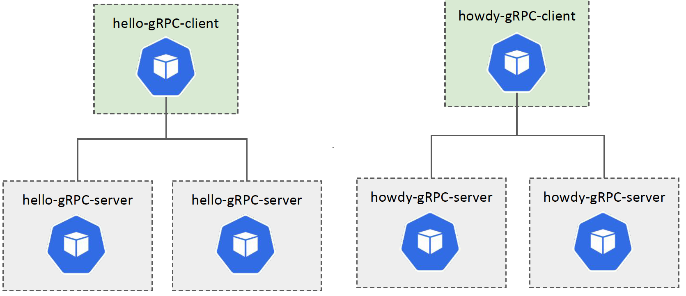
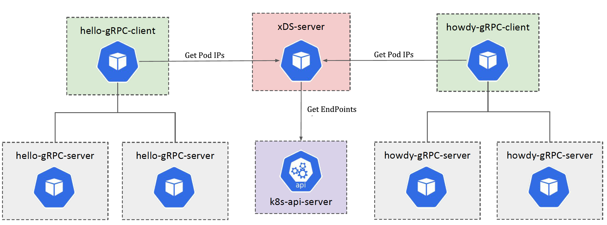

# Proxyless gRPC Loadbalancing

An example repository for demonstrating xDS load-balancer for `Go` gRPC client in a kubernetes cluster. If you are unfamiliar with the xDS protocol or the `Golang` client, please check the _References_ section below.

In this example application, I am using two `gRPC` services (hello and howdy) and clients connecting to those in a load-balanced way. The below diagram shows the setup. 



xDS server discovering the target kubernetes service endpoints using kubernetes APIs. Check the [`getK8sEndPoints`](xds-server/internal/app/resources.go) function.

## Prerequisite

Below, software/tools are required to run the demo. 

- [homebrew](https://brew.sh/)
- A k8s cluster. The example is tested with [k3d](https://k3d.io/) Install k3d using `brew install k3d` 
- Protobuf - `brew install protobuf`
- [Go task](https://taskfile.dev/#/) (trust me it will reduce the keystrokes!) `brew install go-task/tap/go-task`

## Run

To test the repository quickly, I am going to run all commands via `Go Task`. You can look into the all commands in the `Taskfile.yml` (or `Taskfile-*.yml` files. 

### Start Docker and kubernetes cluster

Start Docker and then run `task k3d:start`. This creates a three-node kubernetes cluster.

Run `kubectl cluster-info` and check the cluster is up and running.  

#### Optional Step

Additionally, confirm the nodes are running using `kubectl get nodes` command. Sample output below.

```shell
NAME                 STATUS   ROLES    AGE   VERSION
k3d-local-agent-1    Ready    <none>   14d   v1.18.8+k3s1
k3d-local-agent-0    Ready    <none>   14d   v1.18.8+k3s1
k3d-local-server-0   Ready    master   14d   v1.18.8+k3s1
```

### Deploy the components

#### xDS Server

- Build xDS Server `task xds:build`
- Deploy xDS Server `task xds:deploy`

You can run above in a single command `task xds:build xds:deploy`

#### gRPC Server

- Build gRPC Server `task server:build`
- Deploy gRPC Server `task server:deploy`

You can run above in a single command `task server:build server:deploy`

#### gRPC Client

- Build gRPC Client `task client:build`
- Deploy gRPC Client `task client:deploy`

You can run above in a single command `task client:build client:deploy`

#### Optional Step - Verify all components

Check all the components are running.

Run `kubectl get deployments.apps` to check all deployments. You must see five deployments in the list.

```shell
NAME           READY   UP-TO-DATE   AVAILABLE   AGE
hello-client   1/1     1            1           4d23h
howdy-client   1/1     1            1           4d23h
hello-server   2/2     2            2           4d23h
howdy-server   2/2     2            2           4d23h
xds-server     1/1     1            1           5d
```

Run `kubectl get svc` to check all services. You must see four services on the list.

```shell
NAME           TYPE        CLUSTER-IP      EXTERNAL-IP   PORT(S)     AGE
kubernetes     ClusterIP   10.43.0.1       <none>        443/TCP     14d
xds-server     ClusterIP   10.43.113.60    <none>        18000/TCP   5d
hello-server   ClusterIP   10.43.78.196    <none>        50051/TCP   4d23h
howdy-server   ClusterIP   10.43.228.201   <none>        50052/TCP   4d23h
```

Run `kubectl get pods` to check all pods. You must see seven pods on the list. The pod suffix (after the last -) is going to be different each time.

```shell
NAME                            READY   STATUS    RESTARTS   AGE
howdy-client-659b8f99f5-q6fvx   1/1     Running   1          4d23h
hello-client-5f7bdc5f68-2vkfs   1/1     Running   1          4d23h
xds-server-86c5f6bfcf-f8wks     1/1     Running   1          5d
hello-server-b9ff98f5b-cgvk7    1/1     Running   1          4d23h
howdy-server-7d79c584f6-xbv4l   1/1     Running   1          4d23h
hello-server-b9ff98f5b-l7dmc    1/1     Running   1          4d23h
howdy-server-7d79c584f6-d54zs   1/1     Running   1          4d23h
```

## Validate Proxyless (xDS) load balancing

The server responds to the `gRPC` requests in the code by adding the server host IP. We can use this to identify the target server responding to the client request. 

Let's check the logs from _hello client_ by running `kubectl logs -f deployment/hello-client`

There are two essential things in the logs. 

### xDS calls

You can see logs initiating connections with the xDS server and getting the server's xDS protocol response. This is the point where the client-side load balancer picks the available connections. 

Example response

```shell
INFO: 2020/09/07 01:31:28 [xds] [eds-lb 0xc0002ce820] Watch update from xds-client 0xc0001502a0, content: {Drops:[] Localities:[{Endpoints:[{Address:10.42.0.234:50052 HealthStatus:1 Weight:0} {Address:10.42.1.138:50052 HealthStatus:1 Weight:0}] ID:my-region-my-zone- Priority:0 Weight:1000}]}
```

### gRPC Server Response

You can see the `gRPC` server responding to the client requests. Using the IP address in the `gRPC` response, you can see that the response comes from both replicas of `hello-grpc-server` apps. 

Example response

```shell
{"level":"info","caller":"client/client.go:51","msg":"Hello Response","Response":"message:\"Hello gRPC Proxyless LB from host howdy-server-7d79c584f6-xbv4l\""}
{"level":"info","caller":"client/client.go:51","msg":"Hello Response","Response":"message:\"Hello gRPC Proxyless LB from host howdy-server-7d79c584f6-d54zs\""}
{"level":"info","caller":"client/client.go:51","msg":"Hello Response","Response":"message:\"Hello gRPC Proxyless LB from host howdy-server-7d79c584f6-xbv4l\""}
{"level":"info","caller":"client/client.go:51","msg":"Hello Response","Response":"message:\"Hello gRPC Proxyless LB from host howdy-server-7d79c584f6-d54zs\""}
```

Similarly, you can check the `howdy-client` logs `kubectl logs -f deployment/howdy-client`

## Final Diagram

Here is the diagram representing, whole setup.



## Next Steps

What about scaling the deployments? You can scale (up and down) the `gRPC server` (both `hello` and `howdy`) and see how the xDS load balancing will behave. It may take up to a minute for the client to pick up the changes.

`kubectl scale --replicas=5 deployments.apps/hello-server`

`kubectl scale --replicas=5 deployments.apps/howdy-server`

## Clean up

Remove all the components using `task remove` command.

Remove the `k3d`cluster using `task k3d:delete` command. Alternatively, stop the `k3d` cluster using `task k3d:stop` 

## References

- https://www.envoyproxy.io/docs/envoy/latest/api-docs/xds_protocol
- https://github.com/grpc/proposal/blob/master/A27-xds-global-load-balancing.md
- https://github.com/envoyproxy/data-plane-api/tree/master/envoy/api/v2
- https://github.com/grpc/grpc-go/blob/master/examples/features/xds/README.md
- https://github.com/envoyproxy/go-control-plane/issues/349
- https://medium.com/@salmaan.rashid/grpc-xds-loadbalancing-a05f8bd754b8
